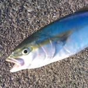

# Python for students

Masashi Shibata  `@c_bata_`

Python 入門者の集い #3 / #pynyumon

2016/08/31

---
## 自己紹介

- `@c_bata_` : 芝田 将
- 明石高専 専攻科(一応、関西在住)
- akashi.py 主催
- Python歴は3年くらい
- カレーメシ先輩って呼ばれてます

<!--
あとですね、料理がちょっと致命的に苦手なんですけど、
以前カレーメシっていうインスタント食品を調理中に爆発させてしまって
特にPythonのコミュニティの方からカレーメシ先輩って呼ばれてます。
この話とても恥ずかしいので、みなさんは芝田くんとかしばちゃんって呼んでください。
-->

---
## アジェンダ

<!-- Pythonを学ぶにあたって自分はこうやってきたよっていうのを話す -->
<!-- ぼくの経験からこういう -->

- BeProudアルバイト
- akashi.py
- 海外のPyCon
- コミュニティ活動
- アウトプットについて

<!--
ブログの話。

最初は知識がないから、自分のしょぼい知識なんてアウトプット出来ないやって思ってたんですけど、これは一番の間違いだと思ってる。
序盤ほどアウトプット

最近ではブログの読者も増えてホットエントリに上がる回数もかなり多くなったんですが、はてぶも60前後で泊まるものが多くて
いまだに約2年前に書いたpysearchを超えるヒットは無い
-->

---
## akashi.py

- Python教えてほしいという後輩が何人書いたので試しに開催
- 関西だと特に勉強会の場は少ないので...
- 参加者は明石高専の後輩中心に11-13人程度

---
## akashi.pyの内容

1. ペアプロを試してみる(4人ぐらいで)
2. connpassのapi叩いて
3. Bottle入門(connpassのapi叩いた結果を表示)
4. SQLAlchemy入門(献立サイトみたいなものを作成)

全4回 全てペアプロベース
第4回は別の後輩に講師してもらった。

---

作りたいものがないのは結構難しい

<!--
自分の経験としてもいろんな言語に軽く手を出してるけど、Webサービスだったりライブラリだったり開発して公開するぐらいまでやらないと中々記憶に残りにくい。
それが難しければブログ書くだけでもだいぶ変わる

作りたいものがなければWebアプリとかは知識として色んな所に活きたり、知識がつくことでアイデアが広がるのでいいかも。

アウトプットをいかにこなすか。これについての話。
一番簡単なのはブログ。

何か作る必要はなくてやったことをまとめればいい。
自分のノートとして考える。
今でこそぼくはPythonにかぎらず、GolangだったりAndroidとかiOS、WebのフロントではReact, Angular2に手を出していますが、本を読んだとかだけではすぐ忘れちゃうんですね。見返すものがないと本当に忘れちゃう。
実は昔PHPとかRuby、Sinatraをやってたことがあったっぽいんですが、その時はブログを作ってなくてテキストにまとめてました。ちょっと前にそのファイルを見つけて、えー自分ってこんなのやってたのって逆に驚いちゃう。
公開して人の見えるところに置いておくと自分がみる回数も増えるし、ローカルに置いてるのと違ってどっかいったりしないんですよね。
あとは当時の自分がRubyとかPHPの環境整えてSinatraとか使って、Hello Worldを動かすところまでいけていたんだっていうのが素直に驚きでしたね。

-->

---
## アウトプット

---
## Community

結構漠然としていて分かりづらいかもしれない

A group of people who live in the same area = 人とのつながり

勉強会とかPyCon、githubとかtwitterみたいなSNS

---
## まとめ

